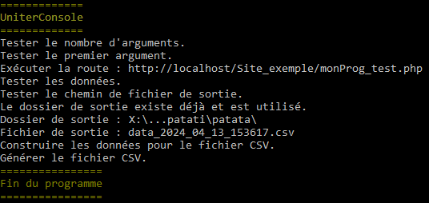

# Uniter

Utilitaires pour réaliser des tests unitaires en PHP et obtenir les résultats en CSV ou JSON.

## Uniter

**Uniter** est un programme PHP servant à effectuer des **tests unitaires** de façon **automatique** et à générer les résultats sous forme de **fichier CSV** ou de **données JSON**.

Le dossier `uniter` se place **dans le dossier de projet du site web**. Ce dossier contient deux fichiers :
- `uniter.php` contient la classe `Uniter` servant à **lancer les tests et générer les résultats**,
- `entree.php` contient la classe `Entree` servant à **définir un test** avec trois valeurs : un **titre**, la **valeur d'entrée** à utiliser pour ce test, le **résultat attendu** en sortie.

Pour effectuer des tests unitaires sur une fonction, comme dans l'exemple proposé il suffit de créer un fichier dédié. Dans l'exemple, c'est `monProg_test.php`. Ce fichier doit contenir :
- une **référence au fichier contenant la fonction** à tester (`require_once`),
- le **nom de la fonction à tester** (`MultiplierPar2`),
- un **tableau** d'`Entree` représentant chaque cas de test,
- un **chemin de fichier CSV de sortie**, que ce fichier CSV soit généré par la suite par le programme lui-même ou bien par un autre,
- l'**instance** d'`Uniter`,
- le **lancement du test et la génération des données de sortie** : `TesterJSON()` pour produire du JSON (par exemple, utiliser `echo` pour les renvoyer) ou bien `TesterCSV()` pour produire le fichier CSV.

Démarrer le programme s'effectue en appelant le fichier de test en tant que route avec le verbe HTTP `GET`. Exemple : 

```
http://localhost/Site_exemple/monProg_test.php
```

Le programme peut **capturer les exceptions** lancées par la fonction testée, mais pas les messages PHP (alertes oranges par exemple). L'exception fait l'objet d'un message comprenant le type de l'exception et le message qui l'accompagne. Pour capturer l'exception, instancier l'`Entree` avec au paramètre `resultatAttendu` le nom du type de l'exception.

## UniterConsole.exe

Le programme **UniterConsole.exe** est de type **Console Windows** et est développé en C#. Il sert simplement à :
- appeler une route qui configure, génère des tests unitaires et en retourne les résultats au format JSON,
- générer avec les données JSON un fichier CSV. 

Pourquoi ce programme puisqu'Uniter peut déjà générer des fichiers CSV ? Eh bien, parce qu'il est des cas où une telle génération est impossible à partir du site web.

La configuration du test unitaire reste centralisée dans le fichier PHP.

UniterConsole.exe est un **programme autonome et nomade** : il peut être placé librement dans n'importe quel dossier du poste local ou distant.

Pour l'utiliser, ouvrir un terminal d'invite de commandes puis l'appeler avec en paramètre l'URL relative aux tests unitaires. Exemple :

```
> Uniter_PHP.exe http://localhost/Site_exemple/monProg_test.php
```

Résultat :



La connexion dure 10 secondes.

La compilation du programme s'effectue depuis le menu `Générer > Publier la sélection`. 
- Mode de déploiement `Autonome`.
- Cocher la case `Produire un seul fichier`.
